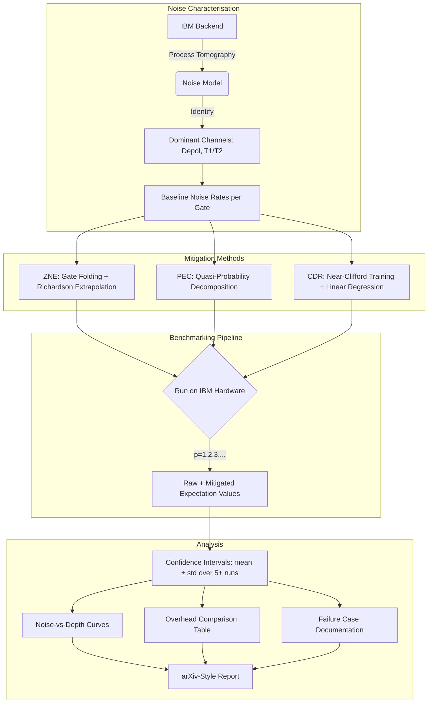

# ⚛️ Quantum Error Mitigation Benchmarking Suite

[](https://github.com/johngeorgea157-stack/quantum-error-mitigation-bench/actions/workflows/ci.yml)
[](https://github.com/johngeorgea157-stack/quantum-error-mitigation-bench/actions/workflows/test.yml)
[](https://codecov.io/gh/johngeorgea157-stack/quantum-error-mitigation-bench)
[](https://www.python.org/)
[](https://qiskit.org/)
[](https://quantum.ibm.com/)
[](LICENSE)
[](https://github.com/johngeorgea157-stack/quantum-error-mitigation-bench)

> Systematically benchmarking Zero-Noise Extrapolation (ZNE), Probabilistic Error Cancellation (PEC), and Clifford Data Regression (CDR) on real IBM hardware. Producing honest, statistically rigorous noise-vs-depth curves.

This project implements and rigorously compares three leading quantum error mitigation techniques on real IBM Quantum hardware. Each method is built as a pluggable mitigator with a common interface, tested on noiseless simulators, then deployed across multiple circuit depths on real backends. The results quantify exactly when each method helps, when it fails, and what the sampling overhead costs — no cherry-picking.

> The goal is not to claim error-free quantum computing, but to **quantify exactly how much fidelity each mitigation method recovers** and at what cost.

---

## 📋 Table of Contents

- [Overview](#-overview)
- [Architecture](#-architecture)
- [Roadmap](#-roadmap)
- [Repository Structure](#-repository-structure)
- [Quickstart](#-quickstart)
- [Results](#-results)
- [CI/CD Pipeline](#-cicd-pipeline)
- [Key References](#-key-references)
- [Limitations](#-limitations)
- [Future Work](#-future-work)

---

## 🔭 Overview

| | |
|---|---|
| **Problem** | Noisy quantum hardware produces erroneous expectation values that degrade with circuit depth |
| **Approach** | Implement ZNE, PEC, CDR as pluggable mitigators; benchmark on parametrised circuits at varying depths |
| **Benchmark** | Noiseless simulator (ground truth) vs raw noisy hardware vs each mitigated result |
| **Hardware** | IBM Quantum real devices + Aer simulator |
| **Metrics** | Mitigated fidelity, overhead (extra circuit evaluations), confidence intervals |

---

## 🏗️ Architecture



---

## 🗺️ Roadmap

### 📖 Phase 1 — Theory + Noise Characterisation `Days 1–3`
- [ ] Read Temme et al. (2017) — ZNE + PEC foundations
- [ ] Understand Richardson extrapolation for ZNE
- [ ] Understand quasi-probability decomposition for PEC
- [ ] Configure Qiskit Runtime with IBM account
- [ ] Understand Estimator vs Sampler primitives
- [ ] Run baseline noisy circuit — record raw fidelity
- [ ] Run process tomography on target backend
- [ ] Identify dominant noise channels (depolarising, T1/T2)
- [ ] Document baseline noise rates per gate type

### ⚡ Phase 2 — Mitigation Implementations `Days 4–6`
- [ ] **ZNE**: Implement noise scaling via gate folding
- [ ] **ZNE**: Implement Richardson extrapolation
- [ ] **ZNE**: Test on simple 2-qubit circuits
- [ ] **PEC**: Implement quasi-probability decomposition
- [ ] **PEC**: Build noise-inverse channel from characterisation data
- [ ] **PEC**: Document sampling overhead
- [ ] **CDR**: Generate near-Clifford training circuits
- [ ] **CDR**: Fit linear regression (noisy → exact)
- [ ] **CDR**: Apply learned correction to target circuit

### 🔌 Phase 3 — Interface + Hardware `Days 7–8`
- [ ] Design abstract `Mitigator` base class
- [ ] Implement: `ZNEMitigator`, `PECMitigator`, `CDRMitigator`
- [ ] Write unit tests for each — correctness on simulator first
- [ ] Submit all 3 mitigators to IBM backend
- [ ] Run 5+ circuit depths per mitigator
- [ ] Collect raw + mitigated expectation values

### 📊 Phase 4 — Analysis + Report `Days 9–12`
- [ ] Compute confidence intervals across circuit depths
- [ ] Run each configuration 5+ times — report mean ± std
- [ ] Plot: mitigated fidelity vs circuit depth per method
- [ ] When does ZNE beat PEC? When does CDR win?
- [ ] Document honest failure cases
- [ ] Compute overhead: extra circuit evaluations per method
- [ ] Write arXiv-style report: Intro, Methods, Results, Discussion
- [ ] Clean repo structure, full README, reproducibility docs

---

## 📁 Repository Structure

```
Quantum Error Mitigation Benchmarking Suite/
│
├── README.md                         # Project overview, roadmap, and structure
├── requirements.txt                  # Pinned dependencies (Qiskit, numpy, scipy, scikit-learn)
├── .gitignore                        # Excludes .env, __pycache__, raw data, notebook checkpoints
│
├── .github/
│   └── workflows/
│       ├── ci.yml                    # Linting (flake8 + black) + import checks on every push/PR
│       └── test.yml                  # Full pytest suite with Codecov coverage upload
│
├── noise_characterisation/
│   ├── characterise_backend.py       # Process tomography + noise channel identification
│   ├── baseline_benchmark.py         # Raw fidelity at p=1,2,3 circuit depths — no mitigation
│   ├── noise_analysis.ipynb          # 📓 EDA: noise rates, dominant channels, baseline fidelity plots
│   └── data/                         # Saved noise models + baseline measurements (JSON)
│
├── mitigation/
│   ├── __init__.py                   # Package init — exports all mitigator classes
│   ├── base.py                       # Abstract Mitigator base class interface
│   ├── zne.py                        # Zero-Noise Extrapolation: gate folding + Richardson extrap.
│   ├── pec.py                        # Probabilistic Error Cancellation: quasi-prob decomposition
│   ├── cdr.py                        # Clifford Data Regression: near-Clifford training + regression
│   ├── zne_demo.ipynb                # 📓 ZNE exploration: noise scaling, extrapolation curves
│   ├── pec_demo.ipynb                # 📓 PEC exploration: decomposition, overhead analysis
│   ├── cdr_demo.ipynb                # 📓 CDR exploration: training circuits, regression fit
│   └── tests/
│       ├── __init__.py
│       ├── test_zne.py               # ZNE correctness on noiseless simulator
│       ├── test_pec.py               # PEC correctness + overhead bounds
│       └── test_cdr.py               # CDR regression fit quality
│
├── benchmarks/
│   ├── run_all_mitigators.py         # Runs all 3 methods across circuit depths on real hardware
│   ├── circuits.py                   # Parametrised test circuits at varying depths
│   ├── hardware_runner.ipynb         # 📓 Submit + monitor IBM Quantum jobs
│   └── tests/
│       ├── __init__.py
│       └── test_circuits.py          # Circuit structure, depth, qubit count validation
│
├── analysis/
│   ├── statistics.py                 # Confidence intervals, mean ± std, overhead computation
│   ├── comparison.py                 # Cross-method comparison: when ZNE > PEC > CDR and vice versa
│   ├── plotting.py                   # Noise-vs-depth curves, comparison bar charts, heatmaps
│   ├── analysis_main.ipynb           # 📓 Master results notebook: loads data, renders all figures
│   └── failure_analysis.ipynb        # 📓 Honest failure cases — where each method breaks down
│
├── results/
│   ├── figures/                      # All exported plots (PNG/SVG): noise-vs-depth, comparisons
│   ├── raw_data/                     # Raw hardware JSON results — gitignored, regenerate via runner
│   └── metrics.csv                   # Summary: method, depth, raw_fidelity, mitigated_fidelity, overhead
│
└── report/
    ├── main.tex                      # arXiv-style LaTeX report
    ├── references.bib                # BibTeX references
    └── figures/                      # Report-specific figures (may symlink to results/figures/)
```

> **📓 = Jupyter Notebook** — narrative exploration + visualisations (learning phase)
> **🐍 = Python module** — reusable, importable, independently testable logic (production)
> Notebooks import from `.py` modules — keeps notebooks clean and logic testable in CI.

---

## ⚡ Quickstart

```bash
# 1. Clone the repo
git clone https://github.com/johngeorgea157-stack/quantum-error-mitigation-bench.git
cd quantum-error-mitigation-bench

# 2. Install dependencies
pip install -r requirements.txt

# 3. Characterise noise on your IBM backend
python noise_characterisation/characterise_backend.py

# 4. Run baseline benchmark (raw fidelity)
python noise_characterisation/baseline_benchmark.py

# 5. Run all mitigators on hardware
python benchmarks/run_all_mitigators.py

# 6. Generate analysis plots
python analysis/plotting.py

# 7. Run test suite
pytest --tb=short
```

> **IBM Quantum hardware runs** require an account token. Add it as a GitHub Secret (`IBM_TOKEN`) or set it locally via `apikey.json` before running hardware scripts.

---

## 📊 Results

> ⏳ Full results will be populated after Phase 3. Placeholder table below.

| Method | Depth p=1 | Depth p=2 | Depth p=3 | Overhead | Notes |
|---|---|---|---|---|---|
| Raw (no mitigation) | — | — | — | 1× | Baseline |
| ZNE (Richardson) | — | — | — | ~3× | Gate folding |
| PEC | — | — | — | ~O(e^n) | High overhead |
| CDR | — | — | — | ~(k+1)× | k training circuits |

---

## 🔄 CI/CD Pipeline

Every push and pull request to `main` triggers:

```
Push / PR to main
    │
    ├── ci.yml ─── flake8 linting (PEP8, max-line 100)
    │          └── black formatting check
    │          └── core import validation
    │
    └── test.yml ── test_zne.py       → ZNE correctness on simulator
                 ├── test_pec.py      → PEC correctness + overhead bounds
                 ├── test_cdr.py      → CDR regression quality
                 ├── test_circuits.py → Circuit structure validation
                 └── coverage upload → Codecov
```

`run_all_mitigators.py` is **excluded from CI** — IBM Quantum jobs require manual execution with an active account token.

---

## 📚 Key References

1. **Temme et al. (2017)** — *Error Mitigation for Short-Depth Quantum Circuits* — [arXiv:1612.02058](https://arxiv.org/abs/1612.02058) — Original ZNE + PEC paper
2. **Czarnik et al. (2021)** — *Error mitigation with Clifford quantum-circuit data* — [arXiv:2005.10189](https://arxiv.org/abs/2005.10189) — CDR method
3. **ZNE Unified Approach** — [arXiv:2011.01157](https://arxiv.org/abs/2011.01157) — Comprehensive ZNE framework

---

## ⚠️ Limitations

- **PEC has exponential sampling overhead** — practical only for short circuits with well-characterised noise
- **CDR assumes noise acts linearly** — breaks down for highly non-linear error channels
- **ZNE extrapolation can amplify statistical noise** at high stretch factors
- **Backend drift** — noise properties change over hours; results depend on calibration timing
- **Limited qubit count** — benchmarks focus on 2–5 qubit circuits due to tomography constraints

These are not bugs — they are the honest boundary conditions of current error mitigation techniques.

---

## 🔮 Future Work

1. **Quantum Error Correction (QEC)** — contrast mitigation (software) vs correction (hardware redundancy)
2. **Dynamical Decoupling** — combine DD pulse sequences with ZNE for compound improvement
3. **Twirled Readout Error eXtinction (TREX)** — add measurement error mitigation layer
4. **Multi-backend comparison** — run same circuits on 3+ IBM backends to assess portability
5. **Integration with quantum-portfolio-opt** — apply best mitigator to QAOA portfolio circuits

---

## 🛠️ Tech Stack

`Python 3.10` · `Qiskit 1.x` · `IBM Quantum` · `NumPy` · `SciPy` · `scikit-learn` · `Matplotlib` · `Seaborn` · `pytest` · `GitHub Actions` · `Codecov`

---

## 📄 License

MIT — see [LICENSE](LICENSE) for details.
